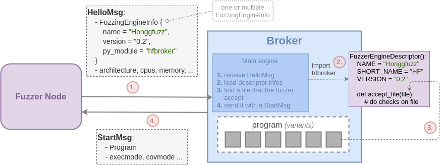

Adding a Fuzzer
===============

Prerequisites
-------------

In order to be integrated in PASTIS a fuzzer should support:

* **receiving new inputs** while running
* providing input/crashes it generates *(preferably as soon as they are produced)*
* providing some telemetry that could be sent to the broker *(current coverage, execution per/sec etc..)*

If the fuzzer does not support such features it first it needs to be modified in order to be compliant.
As a matter of example, Honggfuzz does not support such feature and has been modified
to periodically reading a specific folder for new input files.

Python Driver
-------------

Once the fuzzer is ready and satisfies PASTIS constraints, it can be wrapped in a Python driver
that will act as an interface between the fuzzer and the broker. For that, all the required objects
and types have been defined in ``libpastis``. It notably provides a :py:class:`ClientAgent` object
(:ref:`label_agent_api`) class that one can inherit from in order to interact with the broker. The whole purpose
of a driver is to send data generated by the fuzzer to the broker and to react to some messages it
receives from the broker.

A client can send to following message to the broker:

* **Hello**: Indicating its own architecture, number of CPUs, memory, platform and the engines it supports
* **Seed**: To seed an input or a crash it has generated
* **Data**: To seed alert related information to the broker *(alert covered or validated)*
* **Log**: Logs that seem's relevant to be sent to the broker
* **Telemetry**: Periodic data about the current state of the fuzzing (exec per/sec, coverage, iterations ...)

Conversely it will receive messages, materialized by callbacks that will be called and that the driver should
implement. The messages are the following:

* **Start**: Message to start a fuzzing campain. It contains the program, all the runtime configuration parameters
  that should be used. When receive such callbacks the driver should:
  * check that a campaign is not already running
  * perform all the initializations
  * start the underlying fuzzer with the program and appropriate parameters
* **Seed**: Receive a seed from the broker. The driver should forward it to the fuzzer. It can also apply
  any pre-processing that it considers useful.
* **Stop**: Should stop the campaign

The following snippet show how to instanciate a very simple client agent.

.. code-block:: python

    import logging
    from typing import List
    from libpastis.agent import ClientAgent
    from libpastis.types import SeedType, FuzzingEngine, ExecMode, CoverageMode, SeedInjectLoc, CheckMode, LogLevel, State

    def start_received(fname: str, binary: bytes, engine: FuzzingEngine, exmode: ExecMode, chkmode: CheckMode,
                       covmode: CoverageMode, seed_inj: SeedInjectLoc,
                       engine_args: str, argv: List[str], kl_report: str=None):
        pass # commencer la campagne

    def seed_received(typ: SeedType, seed: bytes):
        logging.info(f"[SEED] { seed.hex()} ({ typ} )")

    def stop_received():
        logging.info(f"[STOP]")

    if __name__ == "__main__":
        agent = ClientAgent()
        agent.connect() # default is localhost:5555
        agent.register_start_callback(start_received)
        agent.register_seed_callback(seed_received)
        agent.register_stop_callback(stop_received)
        agent.start() # start reception thread
        agent.send_hello([(FuzzingEngine.TRITON, "v0.8")])

.. warning:: We recommand inheriting ``ClientAgent`` rather than using it a a standalone object.

Broker Addon
------------

The broker is designed to be independent from the fuzzing engine with which it interacts.
Nonetheless, the broker needs to know which program variant to send the fuzzing engine.
Thus, the fuzzing engine should provide a ``FuzzingEngineDescriptor`` providing basic
information about the engine and a ``accept_file(file)`` method to know whether the file
is suitable for the engine. The broker is then design with an "addon" mecanism allowing
to provide the broker a ``FuzzingEngineDescriptor`` object. The following figure summarizes
the handshake process between a client and the broker.

As shown on the figure when a fuzzer do connect on the broker it should advertize one or multiple
fuzzing engine that it supports with ``FuzzingEngineInfo`` *(all that is encapsulated in the HelloMsg)*.
That object also indicates the name
of the python module to side-load on the broker in order to obtain the ``FuzzingEngineDescriptor``
associated with the engine. The python module should contains a class inheriting ``FuzzingEngineDescriptor``
that describe the engine. *(The broker will automatically find the subclass object within the module).*

You fuzzing driver should thus provide this module to be installed on the broker *(either as a
separate python module or directly within the main driver code)*. The object is is documented
in the API: :ref:`label_engine_desc`.

Examples
--------

There is nothing like examples. Thus one can see existing drivers to see how they are
implemented and how they work. They can be used as a basis for other fuzzing engines.

* tiny test clients: `test_client.py <https://github.com/quarkslab/pastis/blob/main/tests/test_client.py>`_
* Honggfuzz driver: `driver.py <https://github.com/quarkslab/pastis/blob/main/engines/pastis-honggfuzz/pastishf/driver.py>`_
* TritonDSE driver: `pastisdse.py <https://github.com/quarkslab/pastis/blob/main/engines/pastis-triton/pastisdse/pastisdse.py>`_
