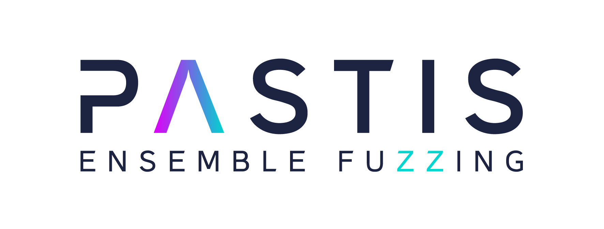

Project Overview
================

The PASTIS project is a fuzzing framework aiming at combining various software testing techniques
within the same workflow to perform collaborative fuzzing also called ensemble fuzzing.

.. raw:: html

    <iframe width="100%" height="400" src="https://www.youtube.com/embed/9uwXciOxtyQ" title="YouTube video player" frameborder="0" allow="accelerometer; autoplay; clipboard-write; encrypted-media; gyroscope; picture-in-picture; web-share" allowfullscreen></iframe>

.. note::

    The video highlight the use-case driven by SAST alerts. However, the
    main use-case the standard fuzzing for coverage or bug research.

Code Components
===============

The codebase is articulated around 3 main components, which, combined together
forms the whole PASTIS infrastructure.

**libpastis**: Pure python library designed perform all network communications
in the context of PASTIS. Its API mostly expose two classes :py:class:`ClientAgent`
and :py:class:`BrokerAgent` that enable acting as a client or a broker respectively.
It also exposes common types between components.

**broker**: head of the infrastructure, acting as an intermediate between each
engines connected. It is in charge of ensuring a maximal sharing of
seeds between clients. Ensuring this sharing enable theoretically to have the same coverage
for all clients. That project is the main interface with the analyst as all configuration options of a
campain are set in pastis-broker and propagated to all clients automatically.

**engines**: They are fuzzing agents, testing the target. They connect to
the broker to receive the fuzzing configuration and initial corpus. Then,
these agents send back to the broker the test-cases produced and absorb
new ones received from the broker.

PASTIS in action
----------------

.. raw:: html

    <iframe width="100%" height="400" src="https://www.youtube.com/embed/YO7ziSPAsxM" title="YouTube video player" frameborder="0" allow="accelerometer; autoplay; clipboard-write; encrypted-media; gyroscope; picture-in-picture; web-share" allowfullscreen></iframe>

.. toctree::
   :caption: Getting Started
   :maxdepth: 2

    Installation <installation>
    Running PASTIS <campaign>
    Adding a Fuzzer <adding-fuzzer>

.. toctree::
   :caption: Fuzzing Engines
   :maxdepth: 3

    AFL++ <engines/aflpp>
    Honggfuzz <engines/honggfuzz>
    TritonDSE <engines/tritondse>

.. toctree::
   :caption: Tutorials
   :maxdepth: 3

    Demo FSM <tutorials/demo-fsm>

.. toctree::
    :caption: Python API
    :maxdepth: 1

    Agents <api/agent>
    Fuzzer Interface <api/descr>
    Binary Package <api/package>
    SAST <api/sast>
    Types <api/types>

..
    pastis-aflpp <api/aflpp>
    pastis-honggfuzz <api/honggfuzz>
    pastis-triton <api/tritondse>

Credits
=======

Sponsors and supporters of the project.

